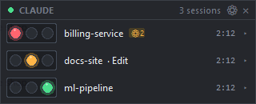
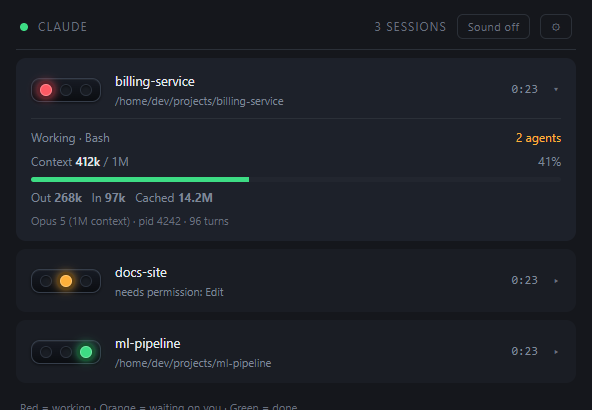
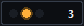
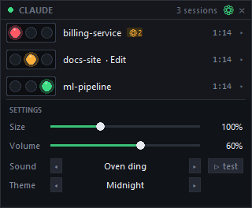
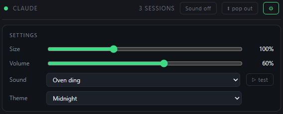
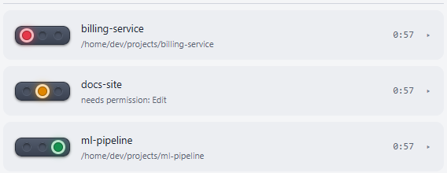
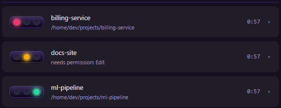
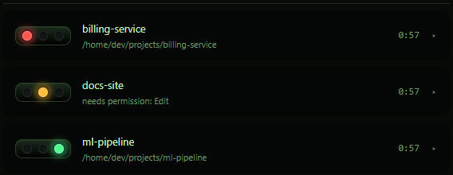
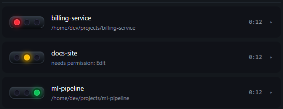

# Claude Traffic Light

A traffic light for every Claude Code session you have running.

**Red** = working &nbsp;&middot;&nbsp; **Amber** = waiting on you &nbsp;&middot;&nbsp; **Green** = done



It sits on top of your windows so you can tell at a glance which session needs
you, dings when one finishes, and opens up to show exactly what each session is
doing and how many tokens it has spent.



---

## What you need

| | |
| --- | --- |
| **Docker** | Docker Desktop on Windows or macOS, Docker Engine on Linux. This is the only hard requirement. |
| **Claude Code**, already installed and run once | So that `~/.claude/` exists — that folder is what gets mounted, and it is where the hooks are registered. |
| **Port 8787** free on localhost | Change the left-hand side of the `ports:` line in `docker-compose.yml` if something else has it. |

Nothing else. Not Python, not Node, no `pip install`. Windows, macOS and Linux
all work; the container detects which and generates the right hook launcher.

## How to start it

```bash
git clone https://github.com/normalwalrus/claude_trafficlight.git
cd claude_trafficlight

docker compose build
docker compose up -d
```

Then open **http://localhost:8787**.

**Restart any Claude Code sessions you already have open.** Sessions that were
running before you installed it *do* appear straight away — the panel reads
Claude Code's own list of live sessions — with their token figures read from
their transcripts, and no lamp lit, because all that is known about them is
that they are running. But hooks are only read when a session starts, so those
sessions will not light up as they work until you restart them. Anything you
open afterwards behaves fully from the start.

That is the whole install. On startup the container copies its hook payload
into your `~/.claude/` and registers it in `settings.json` itself, so:

* nothing needs installing on the host &mdash; not even Python
* the repo can live anywhere, and can be deleted afterwards
* moving or renaming the clone cannot break it

Press **pop out** in the header to float the panel in a small always-on-top
window — Chrome's Document Picture-in-Picture, so it stays above your editor
with nothing installed on the host. Closing it puts the panel back in the tab.

### Checking it worked

```bash
docker compose logs | grep bootstrap    # should name your ~/.claude payload path
curl http://localhost:8787/healthz      # {"ok": true, ...}
```

If the panel says *waiting for Claude sessions* and stays empty, the usual
cause is that no session has been restarted since you installed it.

> **On `settings.json`:** the container edits it to register the hooks. A
> timestamped backup is written before any change, and when the registration is
> already correct nothing is written at all, so repeated `docker compose up`
> runs leave the file untouched. Set `TRAFFICLIGHT_INSTALL_HOOKS=0` in
> `docker-compose.yml` if you would rather it never touched the file.

### Stopping and uninstalling

```bash
docker compose stop             # stop it; hooks stay registered, no lights
docker compose up -d            # start it again

docker compose down             # stop and remove the container
python install.py --remove      # also unregister the hooks and delete the payload
```

`install.py --remove` needs Python; without it, delete the
`~/.claude/claude-trafficlight/` folder and remove the `hooks` entries that
point at it from `~/.claude/settings.json`.

### Optional: the native panel

The browser panel floats fine via **pop out**, but it cannot raise your editor
when you click a row — no container can reach your windows. If you have
Python 3.8+ on the host, add:

```bash
python run.py              # always-on-top widget, click-to-focus
python install.py          # the above, plus a login item
python install.py --check  # what is installed, and is it healthy
python install.py --remove # undo everything
```

Both panels show the same data and can run at the same time.

## What each setup gets you

| Host has                | You get                                            |
| ----------------------- | -------------------------------------------------- |
| Docker only             | Browser panel, **full token data**, always-on-top pop out\*\* |
| Docker + `curl`\*       | Same — the server reads the transcripts itself      |
| Docker + Python         | All of the above, read host-side                    |
| Docker + Python + tkinter | Desktop panel as well: click-to-focus, chimes, minimise badge |

\* `curl` ships with Windows 10+, macOS and most Linux distributions. The
generated hook launcher tries `py`, `python`, `python3`, then `curl`, and
gives up silently rather than ever interfering with Claude.

\*\* **pop out** uses Chrome's Document Picture-in-Picture for a genuinely
always-on-top window. Other browsers fall back to a plain popup, which is still
a small dedicated window but cannot float above other applications.

## How it works

```
Host                                Docker
┌──────────────────┐   POST /event  ┌──────────────┐
│ Claude Code hooks│ ─────────────► │ status server│
│  + token reader  │                │   :8787      │
└──────────────────┘                │  (FastAPI)   │
┌──────────────────┐   POST /live   │              │
│ session watcher  │ ─────────────► │              │
│  (are they alive)│                │              │
└──────────────────┘                │              │
┌──────────────────┐   SSE /stream  │              │
│ panel (native or │ ◄───────────── │  serves the  │
│  browser)        │                │  web panel   │
└──────────────────┘                └──────────────┘
```

* **Hooks** — staged into `~/.claude/claude-trafficlight/` and registered in
  `~/.claude/settings.json`. Never blocks Claude: 1s timeout, all errors
  swallowed, always exits 0. About 90 ms per invocation, and roughly 190 ms
  from Claude starting work to the lamp being lit.
* **Session watcher** — `hooks/session_watch.py`, started by the hook and
  gone when the sessions are. The one thing the container cannot do for
  itself: check that the process behind a registry entry is still running.
* **Token reader** — `hooks/transcript.py` tails the session's transcript
  JSONL, keeping a byte offset per session so each hook parses only what was
  appended (~10 ms, not a full re-read of a multi-megabyte file). It also picks
  up the two lines that say what the session is about: Claude Code's generated
  title and your last prompt.
* **Server** — holds the session table in memory and the settings both panels
  share, pushes snapshots over SSE,
  serves the browser panel, and installs the hooks at startup. It mounts
  `~/.claude` read-write, which is also how it reads transcripts when the host
  has no Python.
* **Panel** — standard library only; no `pip install` anywhere on the host.
  The `×` minimises it to a badge rather than quitting: closing used to end the
  process, and getting it back meant going to a terminal.

### State mapping

| Hook event         | Light  | Meaning                                    |
| ------------------ | ------ | ------------------------------------------ |
| `SessionStart`     | green  | fresh session                              |
| `UserPromptSubmit` | red    | you sent a prompt                          |
| `PreToolUse`       | red    | running tools                              |
| `Notification`     | orange | needs permission, or asked you a question   |
| `Stop`             | green  | turn complete                              |
| `SessionEnd`       | —      | row removed                                |
| *(none yet)*       | dark   | listed by Claude Code, has not reported    |

An amber row that has been waiting more than two minutes escalates on its own,
silently - see [When you have been left waiting](#when-you-have-been-left-waiting).

Claude Code fires `Notification` for twelve different things, and only four of
them mean it is blocked on you. The rest — it has been idle a minute, you
logged in, a background agent finished, a usage limit resumed — leave the lamp
exactly as it was, so a session that has finished stays green instead of going
amber a minute later with nothing running. The `notification_type` field is
what decides; the message text is only consulted on builds too old to send one.

**Every running session is shown, and rows never time out.** Claude Code keeps
a registry of live sessions in `~/.claude/sessions/`, which the container
mounts, so the panel reads liveness rather than guessing it from hook traffic:

* A session is **adopted** onto the panel as soon as Claude Code lists it, even
  if it has never fired a hook — including after the container restarts. Its
  token figures are read straight from its transcript. Until it does fire one,
  **no lamp is lit**: we know it is running, not whether it is working, waiting
  or finished, and a green lamp would claim it had finished.
* A row stays for as long as the session exists, however long it sits idle.
* A row disappears when the session does — you close the editor tab, or quit
  Claude — and immediately on a clean exit via the `SessionEnd` hook.

The `STALE_SECONDS` timeout survives only as the fallback for when that
registry cannot be read at all.

### Knowing a session has really gone

A registry file is written when a session starts and deleted when it ends — if
Claude Code gets the chance. A session that is *killed* rather than quit (you
close the editor window, the terminal goes away, the machine sleeps) never runs
its shutdown, so the file is left behind, and nothing ever rewrites it:
`updatedAt` is not a heartbeat, only a record of the last status change. From
inside the container a dead session is therefore indistinguishable from one you
have had open all morning — which is why a closed session used to sit on the
panel until Claude Code next tidied up after itself.

Only the host can tell the two apart, so `hooks/session_watch.py` does. It is
started by the hook — never by you — checks every few seconds that the process
behind each registry entry is still running (and is still the same process:
pids get reused), and posts the survivors to `POST /live`. Rows they do not
cover go at once.

It is deliberately short-lived: one copy at a time, guarded by a lock file in
the temp directory, and it exits when the sessions are gone, when the server
stops answering for three minutes, or after twelve hours. Closing Claude leaves
nothing running.

`CLAUDE_LIGHT_WATCH=0` turns it off, at the price of closed sessions lingering
on the panel. It also never starts on a host with no Python, where the hooks
fall back to `curl`.

### When the server is not there

If the container stops, or the connection drops, **the panel says so rather
than leaving the last picture up**: every lamp goes out, the rows fade, the
header reads *not connected* and the timers are replaced with `—`. The rows on
screen are only the last thing it was told, which may have stopped being true
some time ago; a confident green for a session that has since ended is exactly
the failure the lights exist to prevent. Both panels reconnect on their own and
relight as soon as the server answers.

## Using it

| Gesture                  | Result                                          |
| ------------------------ | ----------------------------------------------- |
| Drag anywhere            | Move it. Position is remembered and clamped on screen. |
| **Click a row**          | Expand / collapse its detail                    |
| **Double-click a row**   | Focus that session's window                     |
| Right-click              | Settings, always-on-top, alerts, quit           |
| `×` in the header        | Minimise to a small badge                       |
| Click the badge          | Restore the panel                               |
| Right-click → Quit       | Actually close it (the server keeps running)    |



The `×` **minimises** rather than quits. The badge stays on top, lights
whichever state most wants your attention, and shows how many sessions are
running; clicking it brings the panel straight back. Quitting is on the
right-click menu, so it takes a deliberate choice rather than one stray click.

### Telling sessions apart

Expanding a row says what that session is *about*, not just what it is doing:

```
needs permission: Bash
Repository overview
"Sometimes the map's locations disappear
 after clicking around, double check that..."
Context  341k / 1M                      34%
```

Both lines come from Claude Code itself, written into the transcript once a
turn: `ai-title`, the title it generates for the conversation, and
`last-prompt`, the last thing you typed. Neither is reliable on its own - the
title is generated early and goes stale, and the last prompt is often a
fragment like "carry on" - so both are shown when both exist. A long prompt
wraps to two lines and is then cut.

This costs nothing extra to collect: the transcript is already being read for
the token figures, so even a session that has never fired a hook says what it
is working on the moment it is adopted.

### When you have been left waiting

A session that has needed you for more than **two minutes** stops being just
another amber row: it grows, its background breathes amber, and it takes a
bright edge, in both panels. Silent, deliberately - the chime already had its
turn when the session went amber, and a second sound for the same event is how
alerts get ignored.

It stops the moment the session moves on, or you open it. Minimising does not
hide it: the badge's amber lamp breathes in step.

### Finished while you were away

The "finished" banner normally fades after four seconds. If nobody had touched
the machine for five minutes when a session finished, you were not there to
see it, so it stays up until you look - clicking the row is enough, and so is
opening the session. A "needs you" banner still waits until you actually open
that session, as it always did.

Windows only: it asks the OS how long the machine has been idle
(`GetLastInputInfo`), and there is no way to ask that on macOS or Linux
without a dependency. Elsewhere it behaves exactly as it did before.

### Alerts

A state change lights the new lamp with a 250ms cross-fade and a halo swell, and
fades a tinted **banner** across the row saying what happened. Banners appear on
amber and green only — going red is just Claude getting on with it — and a
banner is dropped the moment that session changes again, so a row never keeps
claiming it needs permission after you have answered.

A **finished** banner (`finished · 2m 14s`) clears itself after four seconds. A
**needs-you** banner does not: four seconds is easy to miss and this is the one
message you must not. It stays until you actually open that session — the
desktop panel watches which window is in front, so alt-tabbing to it counts as
much as clicking Focus; the browser panel cannot see your windows, so clicking
the row is what retires it there. Because it parks over the row it also carries
the project name (`docs-site · needs permission: Edit`), so you can still tell
which session is asking.

A sound only fires for a change you could actually see. Subagents run inside
their parent's session, so their churn shows up as the parent changing state —
an agent finishing makes the parent fire `Stop` (green) and immediately pick the
work back up (red), and the green is gone before it reaches the screen. A chime
is therefore held for 700ms and dropped if the state has already moved on —
including when a newer change has since been armed — and a session with agents
still running stays silent because it is not finished. The agent count is read
from the transcript's turn footers, so it can lag by one turn; it is ignored
once stale rather than trusted forever.

Six alert sounds, all synthesised in memory (no audio files):

| Sound | Character |
| ----- | --------- |
| Oven ding | single struck bar, long ring |
| Microwave | three flat-topped digital beeps |
| Desk bell | bright hotel-counter ding |
| Timer bell | mechanical ring-ring, detuned strikes |
| Marimba | warm wooden two-note |
| Glass tink | short, high, delicate |

Each has a *done* variant that rings on and a shorter *needs-you* variant, so
the two are never confused. What separates them is mostly the partial set: a
struck bar rings at ~1 : 2.76 : 5.40 : 8.93 with the upper modes dying first,
a marimba bar at 1 : 4 : 10, and a beep is a plain harmonic stack held flat.

### Settings



The ⚙ in the header opens an inline settings panel (also in the right-click
menu, and in the browser panel's header):

* **Size** — scales the whole panel from 75% to 150%; width, rows, lamps and
  fonts all grow together.
* **Volume** — a 0-100 slider; 0 is silent and plays nothing at all.
  The curve is squared rather than linear, because perceived loudness
  runs roughly with the square root of amplitude - a linear slider would
  sound equally loud over most of its travel.
* **Sound** — pick one of the six, with a test button.
* **Theme** — six colour schemes.

**Sound, volume and theme are one setting, not one per panel.** Both panels
chime at the same events, so a choice kept in one of them meant picking a sound
in the browser and still hearing the desktop panel's old one. The server holds
them (`GET`/`PUT /settings`), every snapshot carries them, and whichever panel
you change follows in the other within a second. They are stored in
`~/.claude/claude-trafficlight/panel-settings.json`, so they survive rebuilding
or deleting the container, and each panel keeps a local copy so it still looks
right before the first snapshot arrives.

The first panel to connect to a server that has never been told anything sends
up the choice it already had, so nothing resets you to the defaults.

Size and position stay per panel - they are about the window, not about you -
as does the browser's own **Sound on/off** button, which is a permission the
browser grants on a click rather than a preference.



### Themes

| | |
| --- | --- |
| **Daylight** | **Neon** |
|  |  |
| **Terminal** | **High contrast** |
|  |  |

Plus **Midnight** (the default, shown at the top) and **Sepia**.

**Every theme uses a true red, amber and green.** A theme may change how bright
or how saturated a lamp is, but never which colour it is — a pink or a teal
stops it reading as a traffic light at a glance. The test suite enforces this
by checking each lamp's hue falls in the right band.

Because hue alone therefore cannot help someone who cannot tell red from green,
the other two cues carry that weight: lamp *position* never changes in any theme
(left is working, middle is waiting on you, right is done), and **High contrast**
additionally spreads the three lamps as far apart in brightness as those colours
allow.

Themes are defined once in `panel/themes.py` and exported to
`server/static/themes.json`, so both panels stay identical. The test suite
checks every theme defines every colour, that each lamp is a true red, amber or
green, that text keeps enough contrast against its background, and that a lit
lamp is always clearly brighter than an unlit one.

The desktop panel stores these in `%APPDATA%\claude-trafficlight\panel.json`;
the browser panel keeps its own in `localStorage`. Both read the same sound
definitions, exported to `server/static/sounds.json` from `panel/chime.py`.


## Token figures

Read from the session transcript, so they are exact, not estimates.

* **Context** — the input tokens on the most recent turn, against the model's
  window. This is the number that predicts compaction.
* **Out / In** — cumulative across the session. *In* includes cache writes.
* **Cached** — cache reads, shown separately on purpose: they routinely reach
  tens of millions and would make a single "tokens used" figure meaningless.
* **Agents** — subagents currently running for that session. Subagents run
  *inside* their parent session and never get a row of their own, so the
  collapsed row shows a small `⚙N` badge instead — in both panels.

The context limit is read from the transcript's model attachment, which is the
only place the `[1m]` suffix appears — `message.model` says `claude-opus-5` for
both the 200k and 1M variants. Override with `CLAUDE_LIGHT_CONTEXT_LIMIT`
(`200k`, `1m`, or a raw number) if it ever guesses wrong.

Sessions started before the hooks were installed show *"No token data"* until
you restart them.

## Everyday commands

```bash
docker compose up -d          # start (and install/refresh the hooks)
docker compose down           # stop it
docker compose logs | grep bootstrap   # what the hook install did
docker compose logs -f        # server logs
python scripts/demo.py        # drive three fake sessions through every state
curl http://127.0.0.1:8787/sessions
curl http://127.0.0.1:8787/healthz     # "host_watcher": is anything checking
                                       # that the listed sessions are alive?
curl http://127.0.0.1:8787/settings    # the sound, volume and theme both
                                       # panels are using
```

## Tests

```bash
python tests/run_all.py            # everything
python tests/run_all.py panel hook # just those modules
```

285 tests, zero dependencies. The server tests skip unless `fastapi` is
importable;
install `server/requirements.txt` into a venv to run them too. Nothing in the
suite touches your real `settings.json`, port 8787, or the running panel.

## Notes and limits

* **Click-to-focus lands on the window, not the tab.** VS Code and Windows
  Terminal expose no way to select a specific tab from outside. Sessions in
  separate windows jump exactly right; two sessions in one window both raise
  that window.
* The hook payload is a *copy* in `~/.claude/claude-trafficlight/`. Changing
  the repo has no effect until the next `docker compose up` (or
  `python install.py`) re-stages it.
* Only paths inside the mounted `~/.claude` are ever read from a hook payload;
  anything else is refused.
* Session state is in memory. Restarting the container re-reads Claude Code's
  registry, so the rows come straight back - with no lamp lit until each
  session reports its next event.
* The hook launcher caches which interpreter it found in
  `~/.claude/claude-trafficlight/interpreter.txt`; the next `docker compose up`
  reads that and registers Python directly, dropping the shell from the chain.
  Delete the file if you change Python installations.
* The server binds to `127.0.0.1` only. Point the panel and hooks elsewhere
  with `CLAUDE_LIGHT_URL`.
* On Linux, click-to-focus needs `wmctrl` or `xdotool`, and chimes need one of
  `paplay` / `aplay` / `ffplay`. `install.py --check` tells you what is missing.
