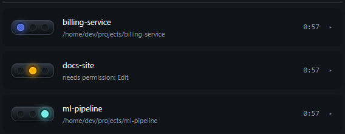

# Claude Traffic Light

A traffic light for every Claude Code session you have running.

**Red** = working &nbsp;&middot;&nbsp; **Orange** = waiting on you &nbsp;&middot;&nbsp; **Green** = done


It sits on top of your windows so you can tell at a glance which session needs
you, dings when one finishes, and opens up to show exactly what each session is
doing and how many tokens it has spent.


---

## Setup

Two commands. You need Docker; nothing else.

```bash
docker compose build
docker compose up -d
```

Open **http://localhost:8787** and you are done.

That really is the whole install. On startup the container copies its hook
payload into your `~/.claude/` and registers it in `settings.json` itself, so:

* nothing needs installing on the host &mdash; not even Python
* the repo can live anywhere, and can be deleted afterwards
* moving or renaming the clone cannot break it

**Restart any Claude Code sessions that are already running** &mdash; hooks are
read at session start. New sessions appear on their own.

> To stop it touching `settings.json`, set `TRAFFICLIGHT_INSTALL_HOOKS=0` in
> `docker-compose.yml`. A timestamped backup is written before any change.

### Uninstall

```bash
docker compose down
python install.py --remove     # unregisters the hooks and removes the payload
```

### Optional: the native panel

The browser panel cannot float above your windows or raise your editor — no
container can. If you have Python 3.8+ on the host, add:

```bash
python run.py              # always-on-top widget, click-to-focus
python install.py          # the above, plus a login item
python install.py --check  # what is installed, and is it healthy
python install.py --remove # undo everything
```

Both panels show the same data and can run at the same time.

## What the host needs

| Host has                | You get                                            |
| ----------------------- | -------------------------------------------------- |
| Docker only             | Browser panel, lights, **full token data**          |
| Docker + `curl`\*       | Same — the server reads the transcripts itself      |
| Docker + Python         | All of the above, read host-side                    |
| Docker + Python + tkinter | Always-on-top panel, click-to-focus, chimes       |

\* `curl` ships with Windows 10+, macOS and most Linux distributions. The
generated hook launcher tries `py`, `python`, `python3`, then `curl`, and
gives up silently rather than ever interfering with Claude.

## How it works

```
Host                                Docker
┌──────────────────┐   POST /event  ┌──────────────┐
│ Claude Code hooks│ ─────────────► │ status server│
│  + token reader  │                │   :8787      │
└──────────────────┘                │  (FastAPI)   │
┌──────────────────┐   SSE /stream  │              │
│ panel (native or │ ◄───────────── │  serves the  │
│  browser)        │                │  web panel   │
└──────────────────┘                └──────────────┘
```

* **Hooks** — staged into `~/.claude/claude-trafficlight/` and registered in
  `~/.claude/settings.json`. Never blocks Claude: 1s timeout, all errors
  swallowed, always exits 0. About 90 ms per invocation, and roughly 190 ms
  from Claude starting work to the lamp being lit.
* **Token reader** — `hooks/transcript.py` tails the session's transcript
  JSONL, keeping a byte offset per session so each hook parses only what was
  appended (~10 ms, not a full re-read of a multi-megabyte file).
* **Server** — holds the session table in memory, pushes snapshots over SSE,
  serves the browser panel, and installs the hooks at startup. It mounts
  `~/.claude` read-write, which is also how it reads transcripts when the host
  has no Python.
* **Panel** — standard library only; no `pip install` anywhere on the host.

### State mapping

| Hook event         | Light  | Meaning                                    |
| ------------------ | ------ | ------------------------------------------ |
| `SessionStart`     | green  | fresh session                              |
| `UserPromptSubmit` | red    | you sent a prompt                          |
| `PreToolUse`       | red    | running tools                              |
| `Notification`     | orange | needs permission, asked a question, or idle |
| `Stop`             | green  | turn complete                              |
| `SessionEnd`       | —      | row removed                                |

**Every running session is shown, and rows never time out.** Claude Code keeps
a registry of live sessions in `~/.claude/sessions/`, which the container
mounts, so the panel reads liveness rather than guessing it from hook traffic:

* A session is **adopted** onto the panel as soon as Claude Code lists it, even
  if it has never fired a hook — including after the container restarts. Its
  token figures are read straight from its transcript.
* A row stays for as long as the session exists, however long it sits idle.
* A row disappears when the session does — you close the editor tab, or quit
  Claude — and immediately on a clean exit via the `SessionEnd` hook.

The `STALE_SECONDS` timeout survives only as the fallback for when that
registry cannot be read at all.

## Using it

| Gesture                  | Result                                          |
| ------------------------ | ----------------------------------------------- |
| Drag anywhere            | Move it. Position is remembered and clamped on screen. |
| **Click a row**          | Expand / collapse its detail                    |
| **Double-click a row**   | Focus that session's window                     |
| Right-click              | Settings, always-on-top, alerts, quit           |
| `×` in the header        | Quit the panel (the server keeps running)       |

### Alerts

A state change lights the new lamp with a 250ms cross-fade and a halo swell, and
fades a tinted **banner** across the row for 4 seconds saying what happened
(`finished · 2m 14s`, `needs permission: Edit`). Banners appear on orange and
green only — going red is just Claude getting on with it — and a banner is
dropped the moment that session changes again, so a row never keeps claiming it
needs permission after you have answered.

Six alert sounds, all synthesised in memory (no audio files):

| Sound | Character |
| ----- | --------- |
| Oven ding | single struck bar, long ring |
| Microwave | three flat-topped digital beeps |
| Desk bell | bright hotel-counter ding |
| Timer bell | mechanical ring-ring, detuned strikes |
| Marimba | warm wooden two-note |
| Glass tink | short, high, delicate |

Each has a *done* variant that rings on and a shorter *needs-you* variant, so
the two are never confused. What separates them is mostly the partial set: a
struck bar rings at ~1 : 2.76 : 5.40 : 8.93 with the upper modes dying first,
a marimba bar at 1 : 4 : 10, and a beep is a plain harmonic stack held flat.

### Settings


The ⚙ in the header opens an inline settings panel (also in the right-click
menu, and in the browser panel's header):

* **Size** — scales the whole panel from 75% to 150%; width, rows, lamps and
  fonts all grow together.
* **Volume** — a 0-100 slider; 0 is silent and plays nothing at all.
  The curve is squared rather than linear, because perceived loudness
  runs roughly with the square root of amplitude - a linear slider would
  sound equally loud over most of its travel.
* **Sound** — pick one of the six, with a test button.
* **Theme** — six colour schemes, applied to both panels.


### Themes

| | |
| --- | --- |
| **Daylight** | **Neon** |
|  |  |
| **Terminal** | **Colour-safe** |
|  |  |

Plus **Midnight** (the default, shown at the top) and **Sepia**.

**Colour-safe** exists because red/green is the worst possible pairing for the
commonest forms of colour blindness. It separates the lamps by hue *and*
brightness — blue, amber, pale cyan — so they stay distinguishable under
deuteranopia and protanopia. Lamp *position* never changes in any theme: left
is working, middle is waiting on you, right is done.

Themes are defined once in `panel/themes.py` and exported to
`server/static/themes.json`, so both panels stay identical. The test suite
checks every theme defines every colour, that text keeps enough contrast
against its background, and that a lit lamp is always clearly brighter than an
unlit one.

The desktop panel stores these in `%APPDATA%\claude-trafficlight\panel.json`;
the browser panel keeps its own in `localStorage`. Both read the same sound
definitions, exported to `server/static/sounds.json` from `panel/chime.py`.


## Token figures

Read from the session transcript, so they are exact, not estimates.

* **Context** — the input tokens on the most recent turn, against the model's
  window. This is the number that predicts compaction.
* **Out / In** — cumulative across the session. *In* includes cache writes.
* **Cached** — cache reads, shown separately on purpose: they routinely reach
  tens of millions and would make a single "tokens used" figure meaningless.
* **Agents** — subagents currently running for that session. Subagents run
  *inside* their parent session and never get a row of their own, so the
  collapsed row shows a small `⚙N` badge instead.

The context limit is read from the transcript's model attachment, which is the
only place the `[1m]` suffix appears — `message.model` says `claude-opus-5` for
both the 200k and 1M variants. Override with `CLAUDE_LIGHT_CONTEXT_LIMIT`
(`200k`, `1m`, or a raw number) if it ever guesses wrong.

Sessions started before the hooks were installed show *"No token data"* until
you restart them.

## Everyday commands

```bash
docker compose up -d          # start (and install/refresh the hooks)
docker compose down           # stop it
docker compose logs | grep bootstrap   # what the hook install did
docker compose logs -f        # server logs
python scripts/demo.py        # drive three fake sessions through every state
curl http://127.0.0.1:8787/sessions
```

## Tests

```bash
python tests/run_all.py            # everything
python tests/run_all.py panel hook # just those modules
```

Zero dependencies. The server tests skip unless `fastapi` is importable;
install `server/requirements.txt` into a venv to run them too. Nothing in the
suite touches your real `settings.json`, port 8787, or the running panel.

## Notes and limits

* **Click-to-focus lands on the window, not the tab.** VS Code and Windows
  Terminal expose no way to select a specific tab from outside. Sessions in
  separate windows jump exactly right; two sessions in one window both raise
  that window.
* The hook payload is a *copy* in `~/.claude/claude-trafficlight/`. Changing
  the repo has no effect until the next `docker compose up` (or
  `python install.py`) re-stages it.
* Only paths inside the mounted `~/.claude` are ever read from a hook payload;
  anything else is refused.
* Session state is in memory. Restarting the container empties the panel until
  each session reports its next event.
* The hook launcher caches which interpreter it found in
  `~/.claude/claude-trafficlight/interpreter.txt`; the next `docker compose up`
  reads that and registers Python directly, dropping the shell from the chain.
  Delete the file if you change Python installations.
* The server binds to `127.0.0.1` only. Point the panel and hooks elsewhere
  with `CLAUDE_LIGHT_URL`.
* On Linux, click-to-focus needs `wmctrl` or `xdotool`, and chimes need one of
  `paplay` / `aplay` / `ffplay`. `install.py --check` tells you what is missing.
